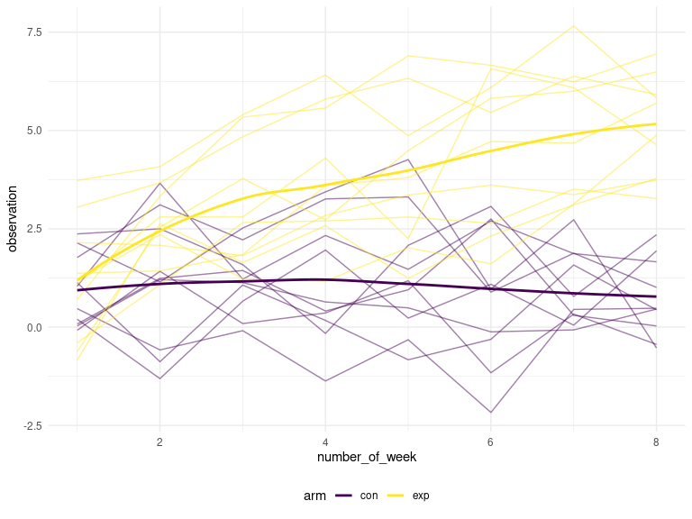
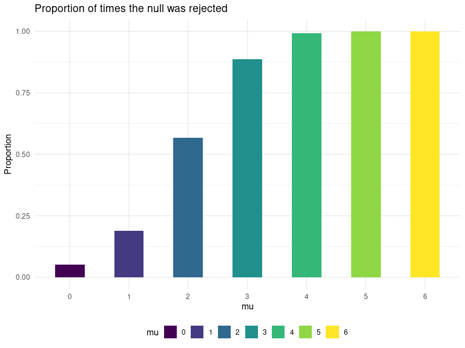
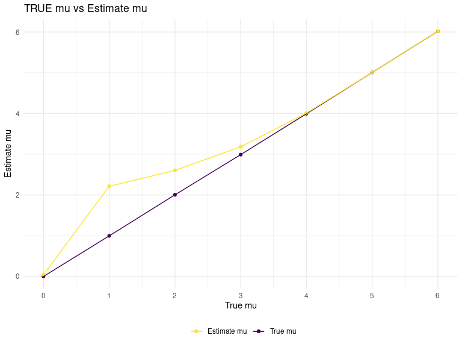

HW 5
================
Jeffrey Liang
11/10/2020

# Problem 2

## Read the data

| arm | subject\_id | number\_of\_week | observation |
| :-- | :---------- | ---------------: | ----------: |
| con | 01          |                1 |        0.20 |
| con | 01          |                2 |      \-1.31 |
| con | 01          |                3 |        0.66 |
| con | 01          |                4 |        1.96 |
| con | 01          |                5 |        0.23 |
| con | 01          |                6 |        1.09 |

## Plot data

<!-- -->

 As we can see from above, the observation from experiment group starts
at the same level as the control group, increases as time passes, while
the observation in control group stay at the same level.

# Problem 3

    ## # A tibble: 5,000 x 14
    ##       mu raw   z_statistics accept_h0     p estimate statistic p.value parameter
    ##    <dbl> <lis>        <dbl> <lgl>     <dbl>    <dbl>     <dbl>   <dbl>     <dbl>
    ##  1     0 <dbl…      -0.220  TRUE      0.482   -1.10     -1.11    0.277        29
    ##  2     0 <dbl…       0.184  TRUE      0.485    0.920     0.924   0.363        29
    ##  3     0 <dbl…      -0.115  TRUE      0.491   -0.576    -0.572   0.572        29
    ##  4     0 <dbl…      -0.156  TRUE      0.488   -0.782    -0.733   0.469        29
    ##  5     0 <dbl…       0.171  TRUE      0.486    0.855     1.07    0.293        29
    ##  6     0 <dbl…      -0.109  TRUE      0.491   -0.543    -0.588   0.561        29
    ##  7     0 <dbl…      -0.0265 TRUE      0.498   -0.133    -0.138   0.891        29
    ##  8     0 <dbl…      -0.0435 TRUE      0.497   -0.217    -0.288   0.775        29
    ##  9     0 <dbl…       0.219  TRUE      0.483    1.09      1.07    0.293        29
    ## 10     0 <dbl…       0.0774 TRUE      0.494    0.387     0.390   0.700        29
    ## # … with 4,990 more rows, and 5 more variables: conf.low <dbl>,
    ## #   conf.high <dbl>, method <chr>, alternative <chr>, t_accept_h0 <lgl>

<!-- --><!-- -->
