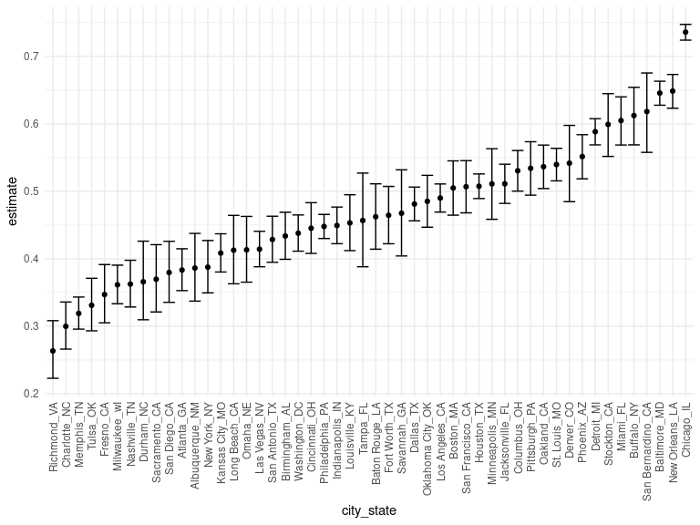
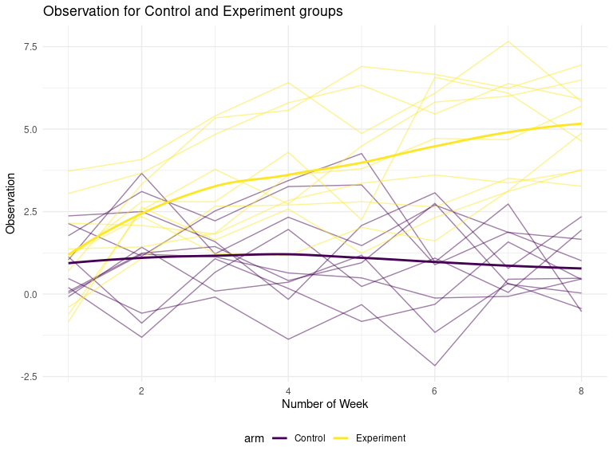
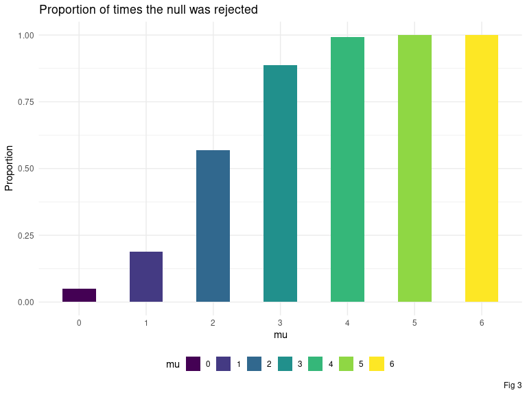
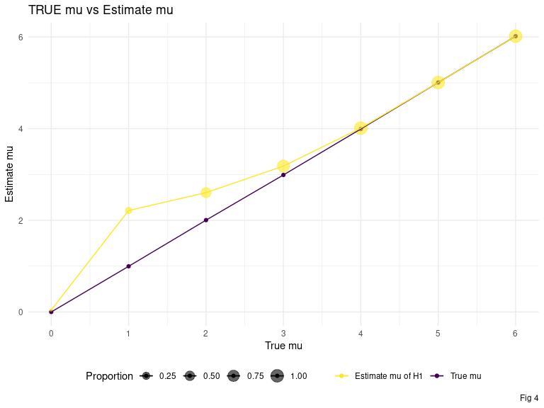

HW 5
================
Jeffrey Liang
11/10/2020

# Problem 1

Read in the data.

``` r
homicide_df = 
  read_csv("data/data-homicides-master/homicide-data.csv") %>% 
  mutate(
    city_state = str_c(city, state, sep = "_"),
    resolved = case_when(
      disposition == "Closed without arrest" ~ "unsolved",
      disposition == "Open/No arrest"        ~ "unsolved",
      disposition == "Closed by arrest"      ~ "solved"
    )
    
  ) %>% 
  select(city_state, resolved) %>% 
  filter(city_state != "Tulsa_AL")
```

``` r
aggregate_df =
  homicide_df %>% 
  group_by(city_state) %>% 
  summarize(
    hom_total = n(),
    hom_unsolved = sum(resolved == "unsolved")
  )
```

Can I do a prop test for a single city?

``` r
prop.test(
  aggregate_df %>% filter(city_state == "Baltimore_MD") %>% pull(hom_unsolved),
  aggregate_df %>%  filter(city_state == "Baltimore_MD") %>% pull(hom_total)
  
) %>% 
  broom::tidy()
```

    ## # A tibble: 1 x 8
    ##   estimate statistic  p.value parameter conf.low conf.high method    alternative
    ##      <dbl>     <dbl>    <dbl>     <int>    <dbl>     <dbl> <chr>     <chr>      
    ## 1    0.646      239. 6.46e-54         1    0.628     0.663 1-sample… two.sided

``` r
results_df = 
  aggregate_df %>% 
  mutate(
    prop_tests = map2(.x = hom_unsolved, .y = hom_total, ~ prop.test(x = .x, n = .y)),
    tidy_tests = map(.x = prop_tests, ~ broom::tidy(.x))
  ) %>% 
  select(-prop_tests) %>% 
  unnest(tidy_tests)
```

``` r
results_df %>% 
  mutate(city_state = fct_reorder(city_state, estimate)) %>% 
  ggplot(aes(x = city_state, y = estimate)) +
  geom_point() +
  geom_errorbar(aes(ymin = conf.low, ymax = conf.high)) +
  theme(axis.text.x = element_text(angle = 90, vjust = 0.5, hjust = 1))
```

<!-- -->

# Problem 2

## Read the data

``` r
rct_dat =
  tibble(file_name =
           list.files(here::here("data"),
                      "con|exp",
                      full.names = T)) %>%
  mutate(data = map(file_name, read_csv)) %>%
  unnest(data) %>%
  mutate(group = str_extract_all(file_name, "(exp_\\d+|con_\\d+)")) %>%
  separate(group, into = c("arm", "subject_id")) %>%
  pivot_longer(
    week_1:week_8,
    names_to = "number_of_week",
    values_to = "observation",
    names_prefix = "week_"
  ) %>%
  mutate(across(number_of_week, as.numeric),
         arm = case_when(arm == "con" ~ "Control",
                         arm == "exp" ~ "Experiment")) %>%
  select(-file_name)

rct_dat %>% head() %>% knitr::kable()
```

| arm     | subject\_id | number\_of\_week | observation |
| :------ | :---------- | ---------------: | ----------: |
| Control | 01          |                1 |        0.20 |
| Control | 01          |                2 |      \-1.31 |
| Control | 01          |                3 |        0.66 |
| Control | 01          |                4 |        1.96 |
| Control | 01          |                5 |        0.23 |
| Control | 01          |                6 |        1.09 |

## Plot data

``` r
plt_spaghetti =
  rct_dat %>%
  unite("id", c(arm, subject_id), sep = ":", remove = F) %>%
  ggplot(aes(x = number_of_week,
             y = observation)) +
  geom_path(aes(color = arm,
                group = as.factor(id)),
            alpha = 0.5) +
  geom_smooth(aes(color = arm), se = F)+
  labs(x = "Number of Week",
       y = "Observation",
       title = "Observation for Control and Experiment groups")

show(plt_spaghetti)
```

<!-- -->

 As we can see from above, the observation from experiment group starts
at the same level as the control group, increases as time passes, while
the observation in control group stays at the same level.

# Problem 3

## Generate simulation data

``` r
z_test =
  function(zscore,
           mu = 0,
           sd = 1,
           method = "two-sided",
           alpha = 0.05) {
    if (method == "two-sided") {
      accept_h0 = between(zscore, qnorm(alpha / 2, mu, sd), qnorm(1 - alpha /
                                                                    2, mu, sd))
      p = pnorm(-abs(zscore), mu, sd)
    } else if (method == "less") {
      accept_h0 = zscore >= qnorm(alpha, mu, sd)
      p = pnorm(-abs(zscore), mu, sd)
    } else if (method == "greater") {
      accept_h0 = zscore <= qnorm(1 - alpha, mu, sd)
      p = pnorm(-abs(zscore), mu, sd)
    } else {
      stop("wrong method")
    }
    
    return(tibble(accept_h0 = accept_h0,
                  p = p))
  }

z_score =
  function(vec, mu = 0, sd = 1) {
    z =
      (mean(vec) - mu) / (sd / sqrt(length(n)))
    return(z)
  }

set.seed(1)
test_data =
  tibble(mu = 0) %>%
  mutate(raw = map(.x = mu, ~rerun(5000, rnorm(30, .x, 5)))) %>% 
  unnest(raw) %>% 
  mutate(
    z_statistics =
      map_dbl(.x = raw,  ~ z_score(
        vec = .x, mu = 0, sd = 5
      )),
    z_test = map(.x = z_statistics, ~ z_test(
      zscore = .x,
      mu = 0,
      sd = 5,
      alpha = 0.05
    )),
    t_test = map(.x = raw, ~ t.test(.x, sd = 5)),
    t_test = map(t_test, broom::tidy)
  ) %>%
  unnest(z_test, t_test) %>% 
  select(mu,estimate,statistic,p.value) %>% 
  mutate(t_accept_h0 = p.value >0.05)

test_data %>% 
  head() %>% 
  knitr::kable()
```

| mu | estimate | statistic | p.value | t\_accept\_h0 |
| -: | -------: | --------: | ------: | :------------ |
|  0 |    0.412 |     0.489 |   0.629 | TRUE          |
|  0 |    0.664 |     0.914 |   0.368 | TRUE          |
|  0 |    0.551 |     0.629 |   0.534 | TRUE          |
|  0 |    0.567 |     0.704 |   0.487 | TRUE          |
|  0 |  \-1.650 |   \-1.959 |   0.060 | TRUE          |
|  0 |    1.185 |     1.230 |   0.229 | TRUE          |

## Test for effect size and power

``` r
set.seed(1)
plot_data =
  tibble(mu = seq(0, 6, 1)) %>%
  mutate(raw = map(.x = mu,  ~ rerun(5000, rnorm(30, .x, 5)))) %>%
  unnest(raw) %>%
  mutate(t_test = map(.x = raw, ~ t.test(.x, mu = 0, sd = 5, conf.level = 0.95)),
         t_test = map(t_test, broom::tidy)) %>%
  unnest(t_test) %>%
  select(mu,estimate,statistic,p.value) %>% 
  mutate(t_accept_h0 = p.value > 0.05)
```

 As plot below, as the effect size of the difference between sample mean
and hypothesis population mean increase from 0 to 6, the power of
rejecting Null hypothesis increase.

``` r
plot_data %>% 
  group_by(mu) %>% 
  summarise(p_reject = 1- sum(t_accept_h0)/n()) %>% 
  mutate(mu = as.factor(mu)) %>% 
  ggplot(aes(x = mu, y = p_reject, fill = mu)) +
  geom_bar(stat = "identity", width = 0.5) +
  labs( title = "Proportion of times the null was rejected",
       y = "Proportion",
       caption = "Fig 3") +
  scale_y_continuous(
    #limits = c(0,0.07)
  ) +
  guides(fill = guide_legend(nrow = 1))
```

<!-- -->

## Estiamte mu favor H1 and the true mu

``` r
ggplot() +
  geom_point(
    data = plot_data %>%
      group_by(mu) %>%
      summarise(estimate = mean(estimate)),
    aes(x = mu,
        y = estimate,
        color = "True mu"),
    show_guide = TRUE
  ) +
  geom_point(
    data =
      plot_data %>%
      filter(t_accept_h0 == F) %>%
      group_by(mu) %>%
      summarise(estimate = mean(estimate),
                Proportion = n() / 5000),
    aes(
      x = mu,
      y = estimate,
      color = "Estimate mu of H1",
      size = Proportion
    ),
    show_guide = TRUE,
    alpha = 0.6
  ) +
  geom_path(
    data = plot_data %>%
      group_by(mu) %>%
      summarise(estimate = mean(estimate)),
    aes(x = mu,
        y = estimate,
        color = "True mu"),
    show_guide = TRUE
  ) +
  geom_path(
    data =
      plot_data %>%
      filter(t_accept_h0 == F) %>%
      group_by(mu) %>%
      summarise(estimate = mean(estimate)),
    aes(x = mu,
        y = estimate,
        color = "Estimate mu of H1"),
    show_guide = TRUE
  ) +
  scale_x_continuous(n.breaks = 7,
                     name = "True mu") +
  scale_y_continuous(name = "Estimate mu",
                     breaks = seq(-2, 8, 2)) +
  scale_color_manual(
    name = '',
    values = c(
      "True mu" = viridis::viridis(2)[[1]],
      "Estimate mu of H1" = viridis::viridis(2)[[2]]
    )
  ) +
  labs(title = "TRUE mu vs Estimate mu",
       caption = "Fig 4")
```

<!-- -->

 The average estimate mu which support for rejecting H0 and favor H1
approximates to the true mu at 0, 4, 5, 6. For case of true mu at 0, the
estimate mus of rejecting H0 are spreading on upper and lower side of
the true mu 0, because of the two-sided test mu we choose is 0. For the
other case, as shown in Fig.3, the power of rejecting H0 increases to
all most 1 as the effect size of difference between true mean and
hypothesis population surpasses 4. Thus, the average mu of rejecting H0
closes to true mean as true mean surpasses 4.
